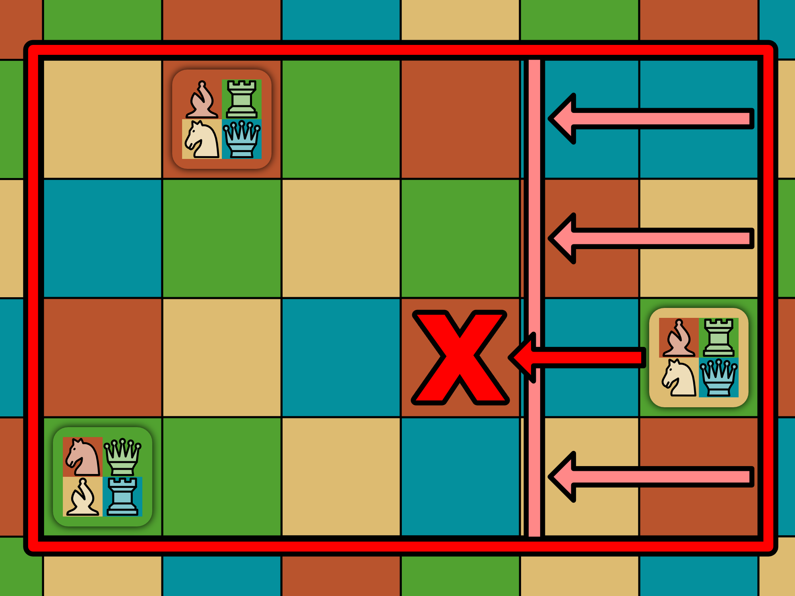
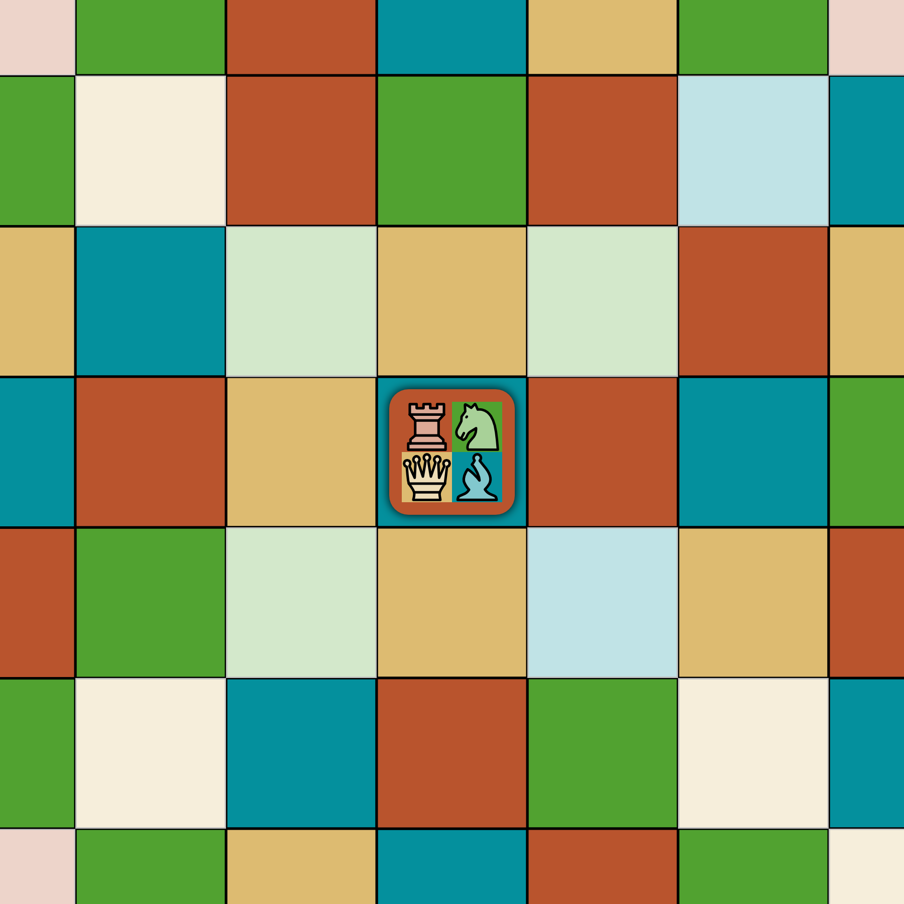

# Chamäleon Schach

Chamäleon Schach ist ein schachähnliches Brettspiel für zwei bis vier Personen.

Chamäleons sind kleine Echsen, die im Urwald leben und ihre Farbe an die Umgebung anpassen. Auf diese Weise tarnen sie sich vor ihren Fressfeinden.

Der besondere Clou bei diesem Spiel besteht darin, dass das Brett nicht nur aus schwarzen oder weißen Feldern besteht, sondern aus vier Farben. So gibt es rote, grüne, gelbe und blaue Felder.

Die Spielfiguren sind kleine Chamäleons. Je nachdem welche Farbe das Feld hat, auf dem eine Figur gerade steht, nimmt sie eine andere Rolle an. So ist sie vielleicht auf einem roten Feld ein Springer, auf einem grünen aber eine Dame.

Dadurch entsteht eine sehr spritzige und dynamische Variante des Schachspiels. Der Spielspaß ist garantiert. :-)

## Spielziel

Jeder Spieler beginnt mit 4 Spielfiguren, die in schachähnlichen Zügen über das Brett bewegt werden und einander schlagen können. Wie sich eine Figur bewegen kann, ist abhängig von der Farbe des Feldes, auf dem sie gerade steht. Sobald ein Spieler keine Figuren mehr übrig hat (weil alle geschlagen worden sind), so hat dieser Spieler verloren und ist aus dem Spiel. Wer als letztes noch Figuren auf dem Feld hat, gewinnt.

## Vorbereitung

Das Spielbrett mit 8x8 bunten Feldern wird in die Mitte gelegt. Die Felder des Spielbretts haben jeweils eine von vier Farben (rot, grün, gelb, blau). Die Anordnung der Farben ist vorgegeben.

Die Spieler wählen sich jeweils eine von insgesamt vier Farben (rot, grün, gelb oder blau). Je nach Farbe setzen sich die Spieler entsprechend um das Spielbrett. Dabei gehört immer die Seite zu einem Spieler, bei der das linke Eckfeld der Farbe des Spielers entspricht.

Nun nehmen die Spieler sich die vier Spielfiguren in ihrer Farbe und platzieren sie auf den vier linken Feldern, beginnend beim linken Eckfeld. Dabei sind die Figuren so zu setzen, dass alle Figuren zu Beginn die Rolle "Springer" haben.

### Spielfiguren

Eine Figur gehört zu genau einem Spieler. Eine Figur nimmt ein ganzes Feld auf dem Brett ein. Es kann nur maximal eine Figur auf einem Feld stehen.

Jede Figur hat eine Farbe-Rolle-Zuordnung. Heißt, zu jedem der vier verschiedenen Farben auf dem Spielbrett (rot, grün, gelb, blau) wird eine von vier Schach-Rollen (Springer, Dame, Läufer, Turm) zugeordnet. Diese Zuordnung ist fester Bestandteil der Figur und ändert sich im Spielverlauf nicht.

Um nun zu ermitteln, welche Rolle eine Figur zur Zeit inne hat (ergo, wie sie sich bewegen kann), wird das Feld betrachtet, auf der sich die Figur gerade befindet. Anschließend wird der Farbe-Rolle-Zuordnung entnommen, welche Rolle die Figur auf einem Feld der entsprechenden Farbe hat.

Sobald sich eine Figur bewegt hat, befindet sie sich im nächsten Zug auf einem anderen Feld mit einer anderen Farbe. Folglich hat sie nun auch eine andere Rolle, die wieder der Zuordnung zu entnehmen ist.

## Spielverlauf

Es ist ein zugbasiertes Spiel. Spieler Rot beginnt. Danach wird im Uhrzeigersinn weitergespielt.

Wer an der Reihe ist, bewegt eine seiner Figuren entsprechend der aktuellen Rolle der Figur. Befindet sich auf dem Zielfeld eine gegnerische Figur, so wird diese geschlagen und ist aus dem Spiel.

Sind alle vier Figuren eines Spielers geschlagen, hat dieser verloren und ist ebenfalls aus dem Spiel.

Es besteht Zugzwang, aber kein Schlagzwang.

### Einengung des Spielfeldes

Nachdem ein Spieler seine Figur bewegt hat, wird überprüft, ob eine oder mehrere der äußeren Reihen frei geworden ist. D.h. in der entsprechenden Reihe befindet sich keine Spielfigur mehr. Ist dies der Fall, so wird das Spielfeld um diese freien Reihen eingeengt.

Das Spielfeld darf allerdings nicht kleiner als 3x3 Felder werden.

Nach der Einengung ist der nächste Spieler an der Reihe.

## Spielende

Gewinner ist der Spieler, welcher als einziger noch eine oder mehrere Figuren auf dem Spielfeld übrig hat.

## Züge der Spielfiguren

Je nachdem welche Farbe das Feld hat, auf dem sich eine Figur befindet, hat diese Figur eine andere Rolle. Je nach Rolle darf eine Figur nur bestimmte Bewegungen ausführen.

### Springer

Der Springer bewegt sich entweder zwei Felder horizontal plus ein Feld vertikal oder zwei Felder vertikal plus ein Feld horizontal. Anders als die anderen Figuren, wird er durch im Weg stehende Figuren nicht behindert. Er "springt" auf sein Zielfeld.

### Läufer

Der Läufer kann sich eine beliebige Anzahl von freien Feldern diagonal von seinem Startfeld aus bewegen. Er kann keine Figuren überspringen, die ihm im Weg stehen.

Steht ihm eine gegnerische Figur im Weg, so kann er diese schlagen. Allerdings endet sein Zug dann auf dem entsprechenden Feld. Eine eigene Figur blockiert sein Fortkommen und kann natürlich nicht geschlagen werden.

### Turm

Der Turm kann sich eine beliebige Anzahl von freien Feldern horizontal bzw. vertikal von seinem Startfeld aus bewegen. Er kann keine Figuren überspringen, die ihm im Weg stehen.

Steht ihm eine gegnerische Figur im Weg, so kann er diese schlagen. Allerdings endet sein Zug dann auf dem entsprechenden Feld. Eine eigene Figur blockiert sein Fortkommen und kann natürlich nicht geschlagen werden.

### Dame

Die Dame ist die stärkste Figur im Spiel. Sie kombiniert die beiden Rollen Läufer und Turm in sich. Eine Dame kann sich also beliebig viele freie Felder horizontal, vertikal oder diagonal von ihrem Startfeld aus bewegen. Gegnerische Figuren können geschlagen werden, stoppen aber die Fortbewegung. Eigene Figuren blockieren das weitere Fortkommen.

## Spezialfall

Gegen Ende des Spieles, wenn das Brett auf 3x3 Felder geschrumpft ist, kann es zu einem Spezialfall kommen. Unter Umständen kommt eine Figur genau auf dem mittleren Feld zum Stehen und hat nun die Rolle "Springer". In diesem Fall kann sich die Figur nicht mehr bewegen, da die möglichen Springerzüge alle außerhalb des geschrumpften Bretts liegen. Daher wird diese Figur nun direkt aus dem Spiel entfernt.

Ist diese Figur allerdings die allerletzte Figur, die überhaupt noch auf dem Brett stehen geblieben ist, so gewinnt trotzdem der Spieler, dem diese Figur gehört.
