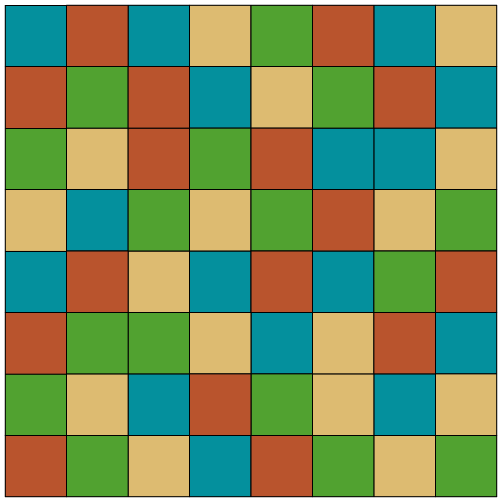
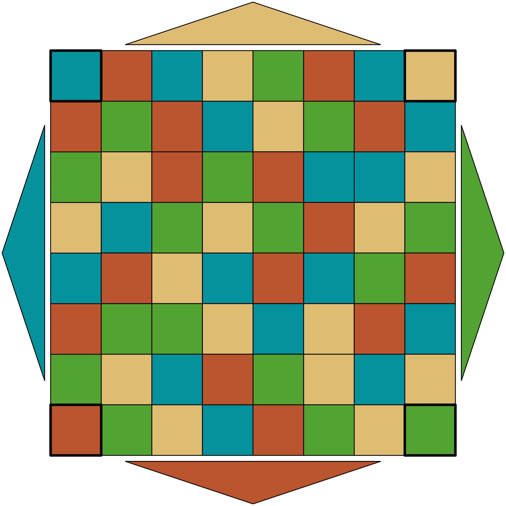
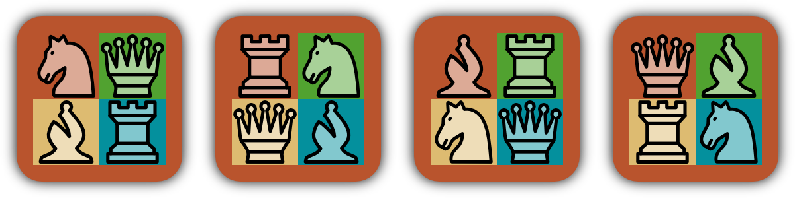
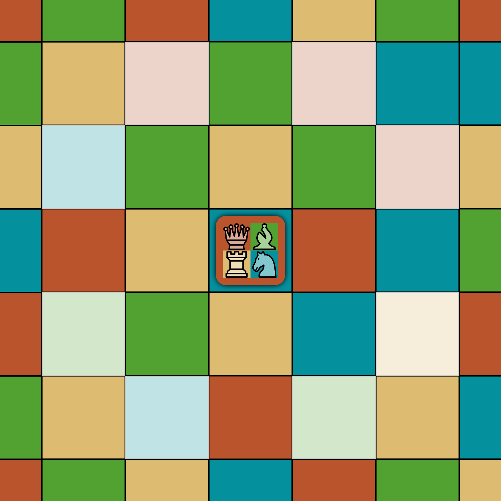
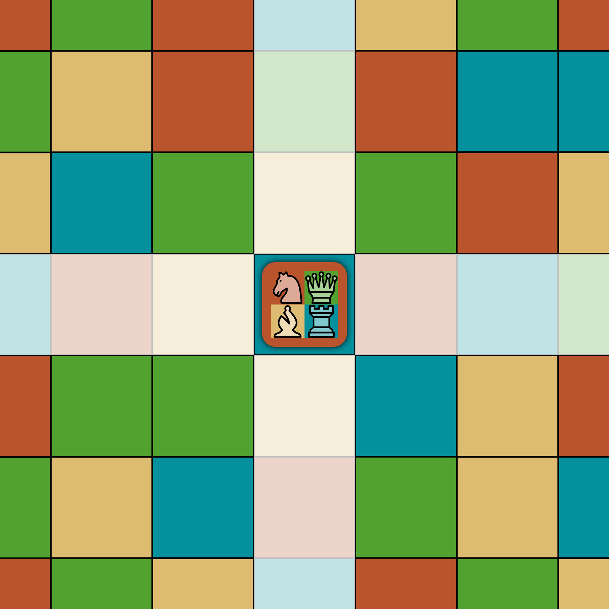
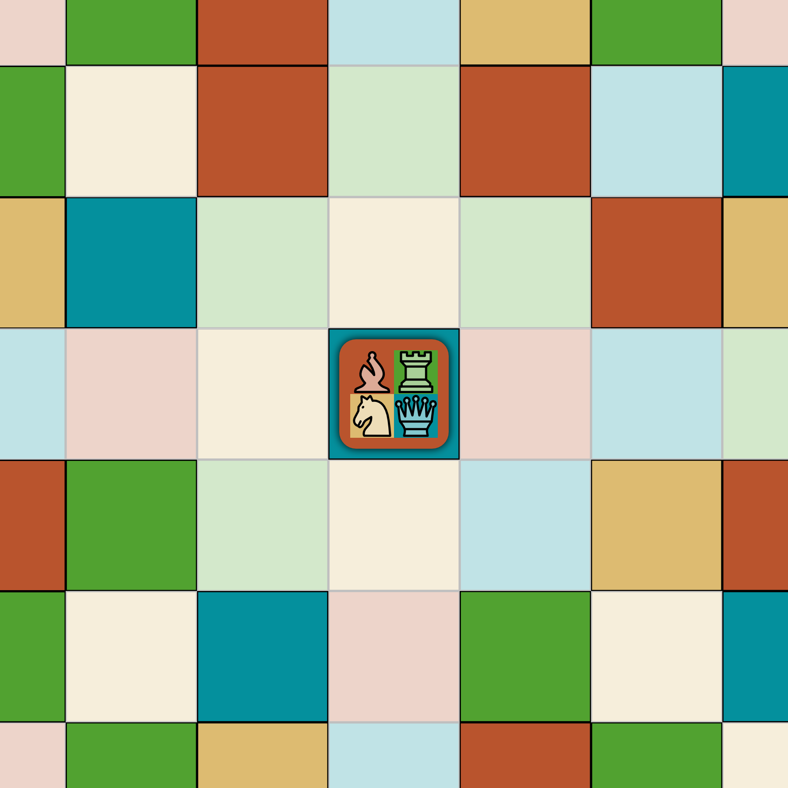

# Chameleon Chess

Chameleon Chess is a chess-like board game for two to four players.

Chameleons are small lizards, that live in the rain forest. They can adapt their skin color to match the colors of their surroundings. That is how they conceal themselves from their natural enemies.

The special treat in this board game is, that the board does not consist of the standard black and white tiles. Instead, there are four different field colors: red, green, yellow and blue.

The pawns are small chameleons themselves. Depending on the color of the field, they are currently on, they assume a different chess role. So, on a red field a pawn may be a knight, on a green field the same pawn however is a queen.

This brings a very dynamic variant of chess. A fun and fresh playing experience is granted. :-)

## The Goal

Every player starts with four pawns. Pawns wander over the board in chess-like moves. Opposing pawns can beat each other. How a pawn can move is determined by the color of the field, the pawn currently stands on. When a player has no pawns left (so, all have been beaten), he loses and is out of the game. The last player with one or more remaining pawns on the board wins.

## Preparation

The game board of 8x8 colorful fields is placed in the center. The fields have either one of four different colors (red, green, yellow, blue). The board layout is predetermined.

The players chose one of four colors (red, green, yellow, blue). Depending on the chosen color, the players are seated accordingly around the board. A side belongs to a player, if the left-most corner field matches the chosen color of the player.

Now, each player gets the four pawns matching his color. The pawns are placed on the four left-most fields. The pawns have to be placed, such that all pawns initially have the role "Knight".

### The Pawns

A pawn belongs to exactly one player. A pawn always covers up a whole field on the board. There can only be up to one pawn per field.

Each pawn has a color-role-map. So, all four colors in the game board (red, green, yellow, blue) are mapped to one of four chess roles (knight, queen, bishop, rook). This mapping is part of the pawn and does not change during the game.

To determine which role a pawn currently has (so, how it can be moved), you need to look at the field, the pawn currently stands on. Now, use the color-role-map to map the current field color to the corresponding role.

When a pawn is moved, it is on a different field in the next turn. Therefore, its role likely has changed as well and has to be determined again as described above.

## How to Play

It is a turn based game. The red player begins, then it goes around clockwise.

When on turn, a player selects on of his pawns and moves it according to its current role. If there is an opponent's pawn on the destination, that pawn is beaten and removed from the game.

When all four pawns of a player are beaten, he has lost and is out of the game.

Players have a compulsion to move, but no compulsion for beating.

### Shrinking of the Game Board

After a player has moved a pawn, check if one or more of the outermost rows have become vacant. So, there is no pawn in the corresponding outer row. If so, the game board shrinks and the vacant rows are removed from the game board.

However, the board must not become smaller than 3x3 fields. So, it won't shrink further when that size is reached.

Now, it is the next players turn.

## End of Game

Once there is just one player left, who still has pawns on the board, the game ends and that player wins.

## Pawn's Moves

Depending on the color of the field, a pawn is standing on, the pawn assumes a different role. Depending on the role, a pawn can move differently.

### Knight

The Knight either moves two field horizontal plus one vertical or two fields vertical plus one horizontal. As opposed to the other roles, a knight is not hindered by any pawns, blocking his way. He just "jumps" to his new location.

### Bishop

The bishop can move any number of free fields diagonally from its staring position. He cannot jump over other pawns blocking the way.

Is there an opponents pawn blocking the way, the opposing pawn is beaten. However, the bishops move then ends on that field. Is there one of the players own pawns blocking the way, that pawn cannot be beaten and simply blocks the movement.

### Rook

The rook can move any number of free fields horizontally or vertically from its staring position. He cannot jump over other pawns blocking the way.

Is there an opponents pawn blocking the way, the opposing pawn is beaten. However, the rooks move then ends on that field. Is there one of the players own pawns blocking the way, that pawn cannot be beaten and simply blocks the movement.

### Queen

The queen is the most powerful role in the game. She combines the roles of bishop and rook. So, a queen can move any number of free fields diagonally, horizontally or vertically from her starting position. Opponent's pawns can be beaten, but stop her movement. Own pawns simply block the way.

## Special Case

As the game progresses, when the smallest board size of 3x3 is reached, there might be a special case. It can happen, that a pawn lands on the center field (of the 3x3 board) and has the role "Knight". In that case the pawn is unable to move again, because all knight moves are outside of the shrunken game board. In that case the corresponding pawn is removed from the board as it is inapt to move anymore.

However, if that pawn is the very last pawn that remains on the board, the player whose pawn that is wins regardless.
